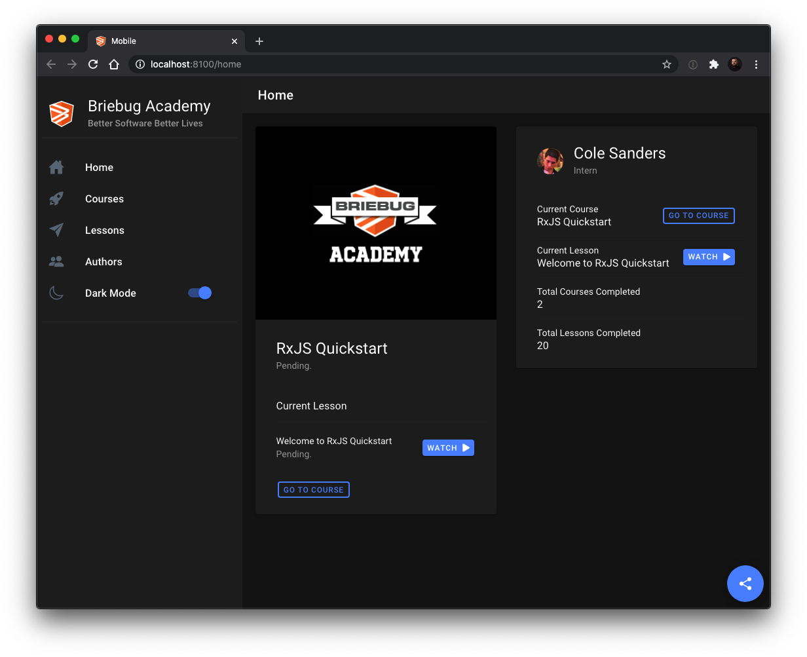

# Ionic Quickstart

This is the sample project for the Ionic Quickstart course from BrieBug Academy. 

The sample project includes an Ionic application, Angular web application, and a mock RESTful API  within an Nx workspace by NRWL. The Ionic and Angular applications use the same state and data libs to manage state and handle server communication. The state lib is built around NgRx and both appliations are entirely reactive. 

<p align="center"></p>

## Prerequisites
- [Git](https://git-scm.com/book/en/v2/Getting-Started-Installing-Git)
- Node.js and NPM – we recommend using [NVM (Linux/Mac)](https://github.com/creationix/nvm) or [NVM-Windows (Windows)](https://github.com/coreybutler/nvm-windows)
- Install Angular CLI via `npm i -g @angular/cli`
- Install Ionic CLI va `npm i -g @ionic/cli`

## Getting Started

```
git clone https://github.com/briebug/bba-ionic-quickstart.git
cd bba-ionic-quickstart
npm i
npm run serve:all
```

The `serve:all` command is a convenience methods that runs three other commands concurrently. You can run each command separately if you need to. 

```
"serve:web": "ng serve --open",
"serve:mobile": "ionic serve --project=mobile",
"serve:api": "json-server server/db.json",
"serve:all": "concurrently \"npm run serve:api\" \"npm run serve:web\" \"npm run serve:mobile\""
```

The web application will open to [http://localhost:4200](http://localhost:4200) in your browser.

The mobile application will open to [http://localhost:8100](http://localhost:8100) in your browser.

You can see the API by navigating to [http://localhost:3000](http://localhost:3000) in your browser.

> Note: the above terminal commands are for Mac. Remember to substitute the appropriate commands for your OS.
